# 🏦 FinCore S.A. — Proyecto Avanzado SQL

Simulación de un sistema de gestión de créditos, construido en **MySQL 8.0+**, que modela el ciclo completo de préstamos: otorgamiento, seguimiento de pagos, auditoría, análisis de cartera y optimización de consultas.

Proyecto desarrollado como práctica de SQL con enfoque en análisis de datos financieros.

Los datos son ficticios y generados para fines educativos.

---

## 🛠️ Tecnologías

[](https://www.mysql.com/)
[](https://www.mysql.com/products/workbench/)

---

## 🎯 Objetivo

Aplicar técnicas avanzadas de SQL en un contexto financiero real, desarrollando objetos de base de datos complejos (funciones, vistas, triggers, procedimientos almacenados) y realizando análisis de cartera de crédito orientados a la toma de decisiones: clasificación de mora, exposición crediticia, índices de riesgo y optimización de consultas con índices.

---

## ❓ Preguntas de Negocio Respondidas

### 📊 Análisis de Cartera

- ¿Cuál es la distribución de la cartera por clasificación de mora (Vigente, Mora Temprana, Mora Media, Mora Alta, Pérdida)?
- ¿Qué porcentaje de la cartera total se encuentra en situación de riesgo?
- ¿Cuáles son los clientes con mayor exposición crediticia acumulada?

### 🔍 Seguimiento de Mora

- ¿En qué rango de antigüedad de mora se concentra el mayor volumen de saldo vencido?
- ¿Qué préstamos presentan más de 30, 60 y 90 días de mora?

### 💳 Comportamiento de Pagos

- ¿Cuál es el historial de pagos de un cliente específico?
- ¿Qué canales de pago son los más utilizados?
- ¿Cuántos pagos incluyen cargos por mora?

### 📋 Reporte Ejecutivo

- ¿Cuál es el resumen mensual de la operación crediticia (desembolsos, cobranza, morosidad)?
- ¿Cuántos préstamos activos, vencidos, cancelados y refinanciados hay por período?

---

## 🗂️ Estructura del Proyecto

```
fincore-sa-sql/
│
├── README.md
├── screenshots/
│   ├── diagrama_er.png                    -- Diagrama entidad-relación
│   ├── vw_estado_cartera.png              -- Vista de estado de cartera
│   ├── vw_resumen_clientes.png            -- Vista de resumen por cliente
│   ├── sp_registrar_pago.png              -- Resultado del procedimiento de pago
│   ├── sp_generar_resumen_mensual.png     -- Resumen mensual generado
│   ├── sp_refinanciar_prestamo.png        -- Refinanciamiento con amortización francesa
│   ├── aging_cartera.png                  -- Análisis de antigüedad de cartera
│   ├── top_exposicion.png                 -- Top clientes por exposición crediticia
│   ├── historial_pagos.png                -- Historial de pagos por cliente
│   ├── reporte_ejecutivo.png              -- Reporte ejecutivo mensual
│   └── explain_indices.png                -- Salida EXPLAIN antes/después de índices
├── scripts/
│   ├── 01_crear_tablas.sql                -- DDL: estructura completa de la base de datos
│   ├── 02_insertar_datos.sql              -- DML: datos de práctica
│   └── 03_consultas_analisis.sql          -- Consultas de análisis de cartera
└── objetos/
    ├── funciones.sql                      -- Función: fn_clasificar_mora
    ├── vistas.sql                         -- Vistas: vw_estado_cartera y vw_resumen_clientes
    ├── triggers.sql                       -- Trigger: trg_auditoria_estado
    ├── procedimientos.sql                 -- Procedimientos: registrar_pago, resumen_mensual, refinanciar
    └── indices.sql                        -- Índices de optimización
```

---

## 🚧 Modelo de Datos

📌 Diagrama ER

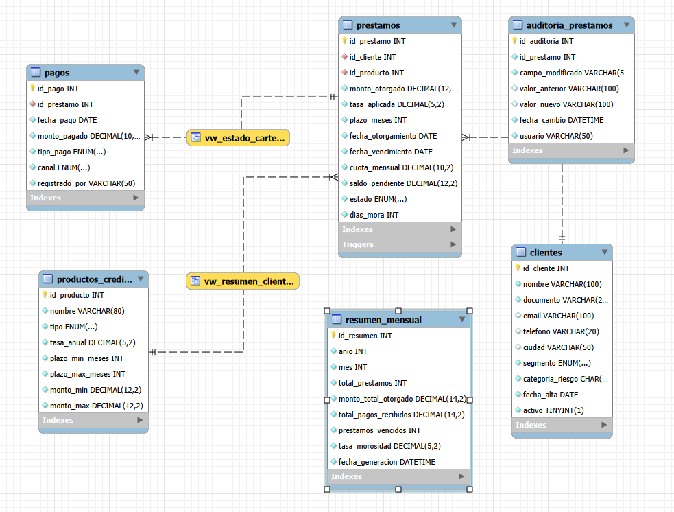

### Tablas de Hechos

Registran transacciones y eventos operativos del negocio.

| Tabla                | Descripción                                      | Columnas principales                                                                                                     |
|----------------------|--------------------------------------------------|--------------------------------------------------------------------------------------------------------------------------|
| `prestamos`          | Registro de cada crédito otorgado                | `id_prestamo`, `id_cliente`, `id_producto`, `monto_otorgado`, `tasa_aplicada`, `saldo_pendiente`, `estado`, `dias_mora` |
| `pagos`              | Pagos recibidos por cada préstamo                | `id_pago`, `id_prestamo`, `fecha_pago`, `monto_pagado`, `tipo_pago`, `canal`                                            |
| `auditoria_prestamos`| Log automático de cambios de estado en préstamos | `id_auditoria`, `id_prestamo`, `campo_modificado`, `valor_anterior`, `valor_nuevo`, `fecha_cambio`, `usuario`           |
| `resumen_mensual`    | Consolidado mensual de operaciones               | `id_resumen`, `anio`, `mes`, `total_prestamos`, `monto_total_otorgado`, `total_pagos_recibidos`, `tasa_morosidad`       |

### Tablas de Dimensión

Proveen contexto descriptivo a las tablas de hechos.

| Tabla               | Descripción                                     | Columnas principales                                                                                  |
|---------------------|-------------------------------------------------|-------------------------------------------------------------------------------------------------------|
| `clientes`          | Registro de clientes personales y empresariales | `id_cliente`, `nombre`, `documento`, `segmento`, `categoria_riesgo`, `ciudad`, `activo`              |
| `productos_credito` | Catálogo de productos financieros disponibles   | `id_producto`, `nombre`, `tipo`, `tasa_anual`, `plazo_min_meses`, `plazo_max_meses`, `monto_min/max` |

---

## ⚙️ Objetos de Base de Datos

### ƒ Función: `fn_clasificar_mora(dias_mora)`

Clasifica un préstamo según sus días de mora en cinco niveles de riesgo, siguiendo los estándares de calificación de cartera financiera.

| Clasificación    | Criterio       |
|------------------|----------------|
| `Al día`         | 0 días         |
| `Mora Temprana`  | 1 – 30 días    |
| `Mora Media`     | 31 – 60 días   |
| `Mora Grave`     | 61 – 90 días   |
| `Mora Crítica`   | Más de 90 días |

```sql
-- Ejemplo de uso
SELECT fn_clasificar_mora(45);
-- Resultado: 'Mora Media'

SELECT id_prestamo, dias_mora, fn_clasificar_mora(dias_mora) AS clasificacion
FROM prestamos;
```

> 📄 Código completo en `objetos/funciones.sql`

---

### 👁️ Vistas

#### `vw_estado_cartera`

Vista analítica del estado actual de la cartera. Consolida datos de préstamos, clientes y productos con la clasificación de mora calculada en tiempo real.

```sql
-- Ejemplo de uso
SELECT clasificacion_mora, COUNT(*) AS cantidad, SUM(saldo_pendiente) AS exposicion
FROM vw_estado_cartera
GROUP BY clasificacion_mora;
```

> 📄 Código completo en `objetos/vistas.sql`

---

#### `vw_resumen_clientes`

Resumen ejecutivo por cliente: total de préstamos activos, saldo total expuesto, cuota mensual comprometida y la peor clasificación de mora registrada entre todos sus créditos. Usa `LEFT JOIN` para incluir clientes sin préstamos activos.

```sql
-- Ejemplo de uso
SELECT nombre, total_prestamos_activos, saldo_total, peor_clasificacion
FROM vw_resumen_clientes
ORDER BY saldo_total DESC;
```

> 📄 Código completo en `objetos/vistas.sql`

---

### ⚡ Trigger: `trg_auditoria_estado`

Se dispara automáticamente después de cada `UPDATE` sobre la columna `estado` de la tabla `prestamos`. Registra en `auditoria_prestamos` el valor anterior, el valor nuevo, la fecha del cambio y el usuario de base de datos que ejecutó la operación.

```sql
-- Se activa automáticamente al ejecutar:
UPDATE prestamos SET estado = 'Cancelado' WHERE id_prestamo = 1;
-- Queda registrado en auditoria_prestamos sin intervención manual
```

> 📄 Código completo en `objetos/triggers.sql`

---

### 📦 Procedimientos Almacenados

#### `sp_registrar_pago(p_id_prestamo, p_monto, p_tipo_pago, p_canal, OUT p_nuevo_saldo)`

Registra un pago sobre un préstamo activo dentro de una transacción atómica. Actualiza el saldo pendiente usando `GREATEST(saldo - monto, 0)` para evitar saldos negativos, y devuelve el nuevo saldo como parámetro `OUT`.

```sql
-- Ejemplo de uso
CALL sp_registrar_pago(1, 1672.00, 'Cuota', 'App', @resultado);
SELECT @resultado;
```

> 📄 Código completo en `objetos/procedimientos.sql`

---

#### `sp_generar_resumen_mensual(p_anio, p_mes)`

Genera o actualiza el consolidado mensual de operaciones en la tabla `resumen_mensual`. Usa `INSERT ... ON DUPLICATE KEY UPDATE` (patrón upsert) para evitar duplicados. Calcula automáticamente: total de préstamos otorgados, monto desembolsado, pagos recibidos, préstamos vencidos y tasa de morosidad del período.

```sql
-- Ejemplo de uso
CALL sp_generar_resumen_mensual(2023, 6);
SELECT * FROM resumen_mensual WHERE anio = 2023 AND mes = 6;
```

> 📄 Código completo en `objetos/procedimientos.sql`

---

#### `sp_refinanciar_prestamo(p_id_prestamo, p_nuevo_plazo, p_nueva_tasa)`

Refinancia un préstamo vencido o activo: marca el préstamo original como `Refinanciado`, calcula la nueva cuota mensual aplicando la **fórmula de amortización francesa** y crea un nuevo préstamo con el saldo pendiente como monto base. Usa `DECIMAL(10,6)` para alta precisión en el cálculo de tasas.

```sql
-- Fórmula aplicada: cuota = saldo * r / (1 - (1 + r)^(-n))
CALL sp_refinanciar_prestamo(14, 36, 16.00);
```

> 📄 Código completo en `objetos/procedimientos.sql`

---

### 🔍 Índices

Índices creados sobre columnas de filtrado y `JOIN` frecuente para optimizar las consultas analíticas de cartera.

| Índice                      | Tabla       | Columna(s)           | Propósito                                         |
|-----------------------------|-------------|----------------------|---------------------------------------------------|
| `idx_prestamos_estado`      | `prestamos` | `estado`             | Filtros por estado de cartera                     |
| `idx_prestamos_cliente`     | `prestamos` | `id_cliente`         | JOINs y agrupaciones por cliente                  |
| `idx_prestamos_mora`        | `prestamos` | `dias_mora`          | Clasificación y análisis de mora                  |
| `idx_prestamos_fecha`       | `prestamos` | `fecha_otorgamiento` | Filtros temporales de desembolso                  |
| `idx_pagos_prestamo`        | `pagos`     | `id_prestamo`        | JOINs en historial de pagos                       |
| `idx_pagos_fecha`           | `pagos`     | `fecha_pago`         | Filtros y agrupaciones por período de pago        |
| `idx_prestamos_estado_mora` | `prestamos` | `estado`, `dias_mora`| Índice compuesto para reportes de cartera vencida |

> ⚠️ **Nota analítica:** En tablas pequeñas, el optimizador de MySQL puede decidir no usar un índice (`key: NULL` en `EXPLAIN`) porque un full scan es más eficiente. Esto es comportamiento esperado, no un error de diseño.

> 📄 Código completo en `objetos/indices.sql`

---

## 🚀 Cómo Ejecutarlo Localmente

### Requisitos

- MySQL 8.0 o superior
- MySQL Workbench (recomendado) o cualquier cliente SQL compatible

### Contenido de cada script

| Archivo                          | Qué contiene                                                                                              |
|----------------------------------|-----------------------------------------------------------------------------------------------------------|
| `scripts/01_crear_tablas.sql`    | `CREATE DATABASE`, `CREATE TABLE` con PKs, FKs, ENUMs y comentarios de columna                           |
| `scripts/02_insertar_datos.sql`  | `INSERT INTO` con 20 clientes, 6 productos, 22 préstamos y más de 50 pagos de práctica                  |
| `scripts/03_consultas_analisis.sql` | Queries de aging, exposición crediticia, historial de pagos y reporte ejecutivo mensual               |
| `objetos/funciones.sql`          | `fn_clasificar_mora` — clasificación de mora en 5 niveles con `CASE`                                     |
| `objetos/vistas.sql`             | `vw_estado_cartera` y `vw_resumen_clientes` con `LEFT JOIN` para cobertura completa de clientes          |
| `objetos/triggers.sql`           | `trg_auditoria_estado` — auditoría automática de cambios de estado con `USER()`                          |
| `objetos/procedimientos.sql`     | `sp_registrar_pago`, `sp_generar_resumen_mensual`, `sp_refinanciar_prestamo` con manejo de transacciones |
| `objetos/indices.sql`            | Índices simples y compuesto con análisis `EXPLAIN` antes/después                                         |

### Pasos de ejecución

```sql
-- 1. Crear la estructura e insertar datos
SOURCE scripts/01_crear_tablas.sql;
SOURCE scripts/02_insertar_datos.sql;

-- 2. Crear objetos en este orden (respetar dependencias)
SOURCE objetos/funciones.sql;
SOURCE objetos/vistas.sql;
SOURCE objetos/triggers.sql;
SOURCE objetos/procedimientos.sql;
SOURCE objetos/indices.sql;

-- 3. Ejecutar análisis de cartera
SOURCE scripts/03_consultas_analisis.sql;
```

> ⚠️ Los objetos deben crearse después de los datos — las vistas y procedimientos dependen de que las tablas existan y tengan contenido para poder verificarse.

---

## 📊 Análisis de Cartera

Consultas analíticas avanzadas construidas directamente sobre las tablas base y las vistas del proyecto.

| # | Análisis                               | Técnica SQL clave                                      |
|---|----------------------------------------|--------------------------------------------------------|
| 1 | Aging de cartera por tramos de mora    | `CASE` anidado, `GROUP BY`, agregaciones condicionales |
| 2 | Top clientes por exposición crediticia | `JOIN` múltiple, `GROUP BY`, `ORDER BY`, `LIMIT`       |
| 3 | Historial de pagos por cliente         | `JOIN` 3 tablas, `WHERE` con parámetro de cliente      |
| 4 | Reporte ejecutivo mensual              | Agregación condicional con `SUM(CASE WHEN ... END)`    |

### Hallazgos del Análisis

**Concentración de riesgo:** La cartera vencida (`dias_mora > 0`) se concentra en tres préstamos que representan clientes de categoría C y D, coherente con la segmentación de riesgo asignada al momento del otorgamiento.

**Exposición crediticia:** Los clientes empresariales concentran los mayores saldos pendientes, con préstamos individuales que superan los $130,000 — lo cual implica que la gestión de riesgo de pocos clientes tiene alto impacto en la cartera total.

**Canales de pago:** El canal `Débito Automático` muestra la mayor regularidad en los pagos, mientras que `Sucursal` aparece asociado con pagos de mora, lo que podría indicar que los clientes en dificultad recurren a canales presenciales.

**Tasa de morosidad:** La cartera vencida representa aproximadamente el 25% de los préstamos en cantidad, pero dado el monto otorgado en créditos empresariales activos, la tasa de mora en saldo es considerablemente menor — patrón real en fintech con mezcla de segmentos.

---

## 📷 Capturas de Resultados Clave

### Vista de Estado de Cartera
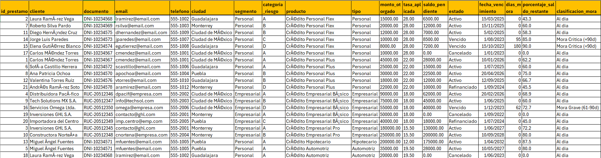

### Vista de Resumen por Cliente
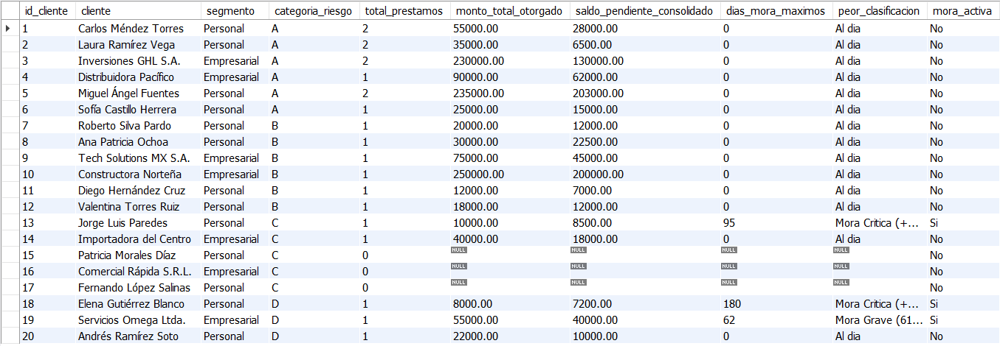

### Procedimiento: Registro de Pago
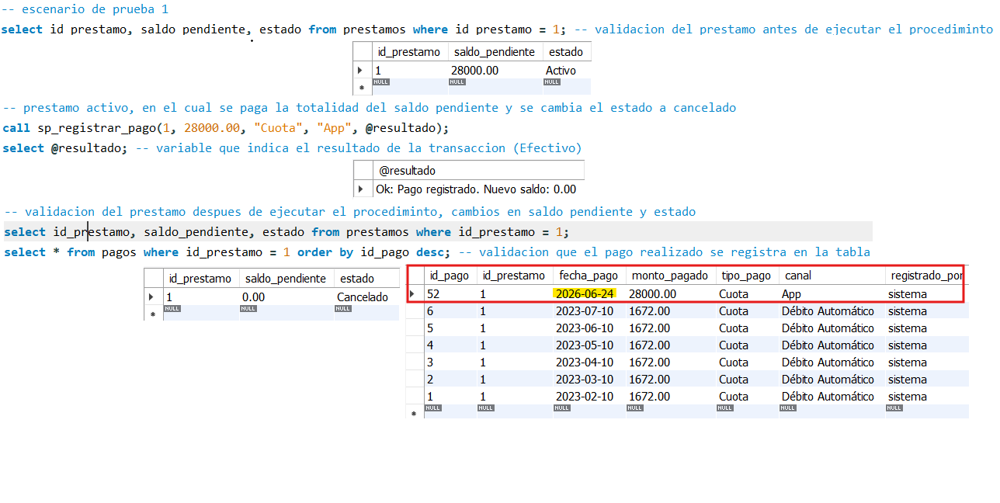

### Resumen Mensual Generado
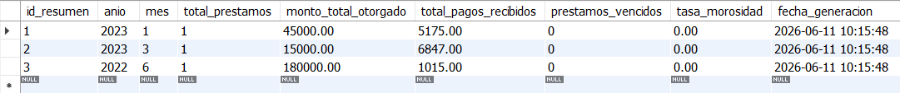

### Refinanciamiento con Amortización Francesa
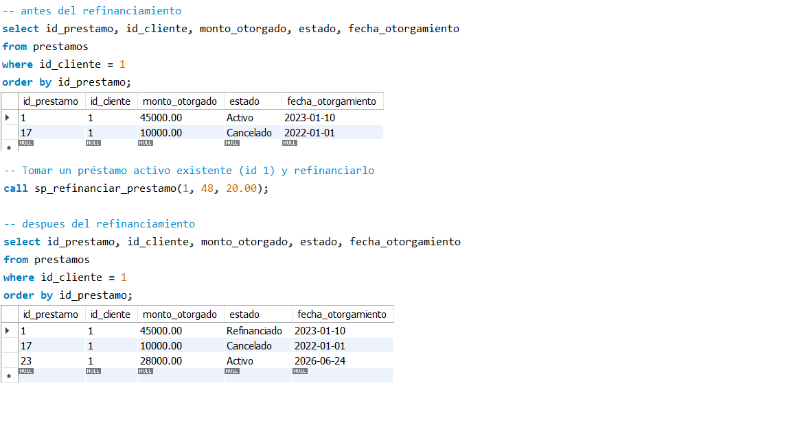

### Análisis de Antigüedad de Cartera (Aging)
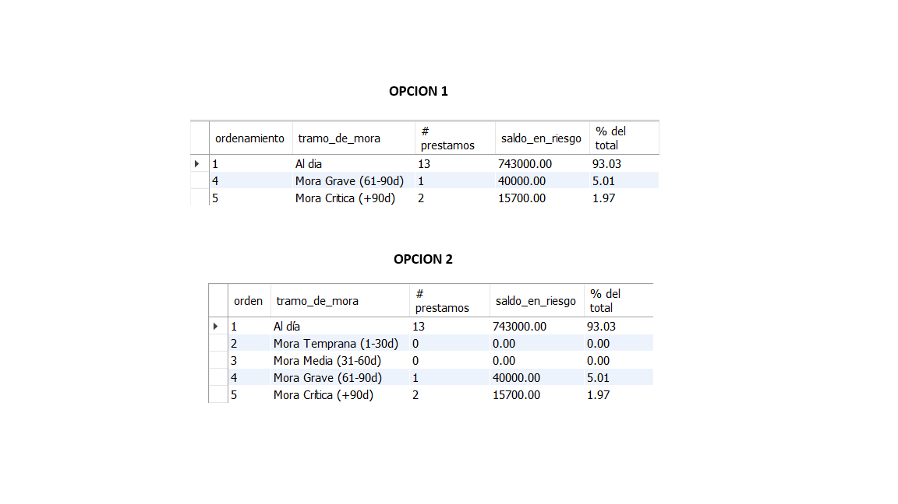

### Top Clientes por Exposición Crediticia
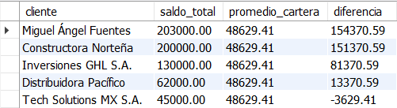

### Historial de Pagos por Cliente
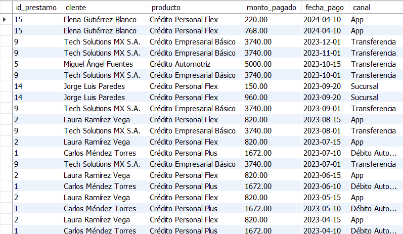

### Reporte Ejecutivo Mensual
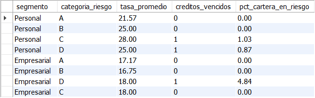

### EXPLAIN — Impacto de Índices en Consultas
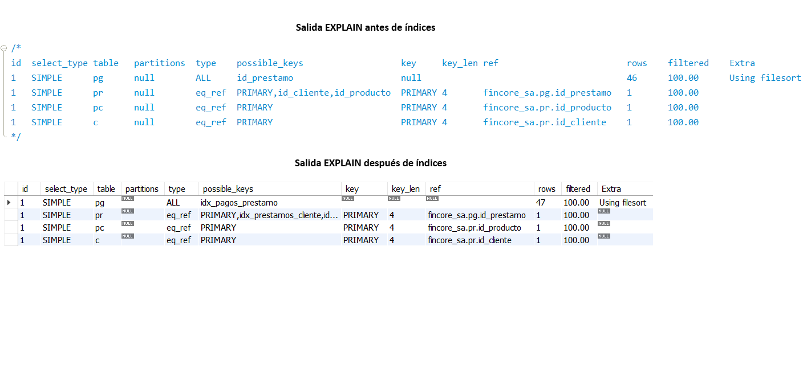

---

## 💡 Conceptos y Técnicas Aplicadas

| Categoría           | Técnica                                                                                |
|---------------------|----------------------------------------------------------------------------------------|
| Funciones           | `DELIMITER`, `RETURNS`, `DETERMINISTIC`, `CASE WHEN`                                   |
| Vistas              | `CREATE OR REPLACE VIEW`, `LEFT JOIN`, subconsultas en `SELECT`                        |
| Triggers            | `AFTER UPDATE`, `IF OLD.campo <> NEW.campo`, `USER()`                                 |
| Procedimientos      | `IN`/`OUT` parameters, `DECLARE`, `HANDLER`, `TRANSACTION`, `COMMIT`/`ROLLBACK`       |
| Manejo de errores   | `DECLARE EXIT HANDLER FOR SQLEXCEPTION`; orden correcto: variables → handlers          |
| Upsert              | `INSERT ... ON DUPLICATE KEY UPDATE` con alias `nuevo`                                 |
| Precisión numérica  | `DECIMAL(10,6)` para tasas de interés; `GREATEST(valor, 0)` para saldos no negativos  |
| Fórmula financiera  | Amortización francesa: `cuota = P * r / (1 - (1+r)^-n)`                               |
| Análisis de mora    | Agregación condicional `SUM(CASE WHEN dias_mora > 30 THEN saldo END)`                 |
| Optimización        | `CREATE INDEX`, `EXPLAIN`, interpretación de `key`, `type`, `Using index`, `filesort` |
| Colaciones          | Resolución de error 1267 con `COLLATE utf8mb4_unicode_ci`                              |
| Aritmética de fechas| `DATE_ADD(fecha, INTERVAL n MONTH)` para cálculo de vencimientos                      |

---

## 📝 Conclusiones

- Modelar un sistema financiero en SQL evidencia cómo la integridad referencial y los ENUMs no son solo formalidades de diseño — son la primera línea de defensa contra datos inconsistentes en una cartera de crédito real.
- La función `fn_clasificar_mora` demuestra que encapsular lógica de negocio directamente en la base de datos garantiza consistencia: cualquier vista, procedimiento o consulta que la consuma siempre aplica la misma regla de clasificación, sin riesgo de divergencias en capa de aplicación.
- El procedimiento `sp_refinanciar_prestamo` con amortización francesa ilustra que SQL no es solo consultas — puede ejecutar lógica financiera compleja con transacciones atómicas, lo que lo hace válido como motor de reglas de negocio en fintechs.
- El análisis `EXPLAIN` reveló un insight contraintuitivo pero importante: un índice ignorado por el optimizador no es un error de diseño, sino una decisión inteligente del motor cuando el full scan es más eficiente para tablas pequeñas. Entender esto separa el análisis técnico real del cargo de culpa instintivo.
- La distinción entre denominador de grupo vs. denominador global en ratios de cartera (PAR por segmento vs. PAR total) es un ejemplo de cómo el criterio analítico cambia el significado de un número — la misma fórmula SQL puede responder preguntas radicalmente distintas según lo que se ponga en el denominador.

---

*Proyecto desarrollado como parte del portafolio de análisis de datos.*
